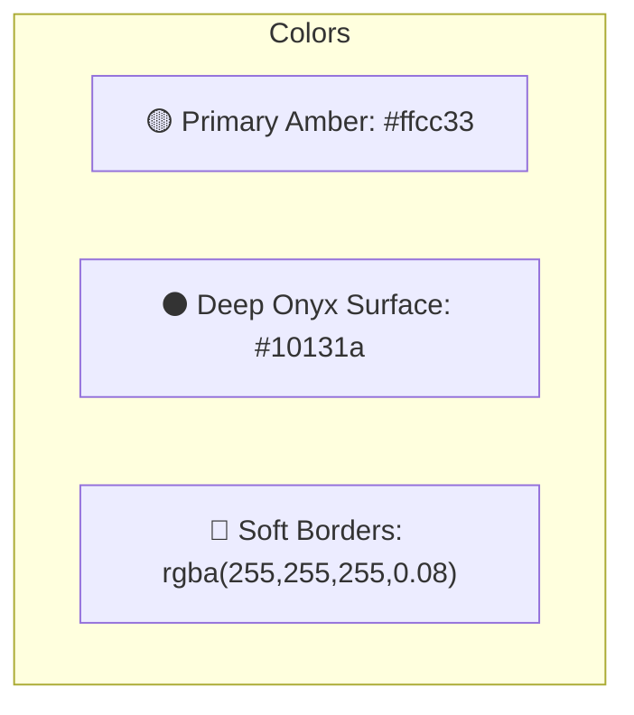

# 🎨 D-Ride Platform: UI & Design System Documentation

Welcome to the central user interface (UI) and design system specification for the D-Ride platform. This document covers the unified Egyptian **Golden Amber & Deep Onyx** dark theme tokens, CSS custom properties, and application-specific layout architectures.

---

## 🏛️ Design Language & Theme Foundation

D-Ride implements a unified dark theme (no light mode toggle) inspired by modern high-contrast premium aesthetics. All apps and packages share this visual specification through the shared package [shared-theme](file:///Users/bishoy/Desktop/D-Ride/packages/shared-theme/src/index.ts).

### 1. Brand Palette
*   **Primary Amber Color**: `#ffcc33` (with active interactive variants `#ebc246` and light overlay values `rgba(255, 204, 51, 0.12)`).
*   **Surfaces (Deep Onyx)**: `#10131a` for core backgrounds, with elevated surface panels at `#1d2027` and hover highlights at `#272a31`.
*   **Typography**: Clean high-contrast text (`#e0e2ec` primary, `#d0c5af` secondary, `#99907b` muted, and `#241a00` for contrast labels on primary buttons).
*   **Borders**: Soft thin boundaries (`rgba(255, 255, 255, 0.08)` default, focused active state `#ffcc33`).



### 2. Typography System
*   **Font Family**: `Inter, -apple-system, BlinkMacSystemFont, 'Segoe UI', Roboto, sans-serif`
*   **Display / Headlines**: Uses generous scale rules (`text-4xl md:text-6xl tracking-tighter leading-none`).
*   **Content / Body**: Optimized reading widths (`text-base leading-relaxed max-w-[65ch]`).

### 3. Spacing & Materiality Tokens
*   **Border Radius**: Scale from small UI elements (`sm: 6px`, `md: 8px`) to cards (`lg: 12px`, `xl: 16px`) and buttons (`full: 9999px`).
*   **Elevations & Shadows**: Soft dark-tinted drop shadows alongside signature glowing highlights:
    *   `--shadow-glow`: `0 0 20px rgba(245, 183, 49, 0.3)`
    *   `--shadow-glow-strong`: `0 0 40px rgba(245, 183, 49, 0.5)`

---

## 🛠️ Unified Integration Methods

The design system exports tokens directly via three methods to ensure cross-app layout harmony:

### A. CSS Custom Properties (Variables)
Exposed globally inside base styles (e.g. `index.css`) to drive Tailwind utility variables:
```css
:root {
  --primary: #ffcc33;
  --background: #10131a;
  --surface: #10131a;
  --surface-elevated: #1d2027;
  --text-primary: #e0e2ec;
  --border: rgba(255, 255, 255, 0.08);
  --radius-lg: 12px;
  --shadow-glow: 0 0 20px rgba(245, 183, 49, 0.3);
}
```

### B. Ant Design ConfigProvider Theme Configuration
Applied as a root provider in the AntD dashboard applications:
```typescript
export const antThemeConfig = {
  token: {
    colorPrimary: '#ffcc33',
    colorBgContainer: '#10131a',
    colorBgLayout: '#10131a',
    colorBgElevated: '#1d2027',
    colorTextBase: '#e0e2ec',
    colorBorder: 'rgba(255, 255, 255, 0.08)',
    borderRadius: 8,
  },
  components: {
    Layout: {
      siderBg: '#0b0e15',
      headerBg: '#10131a',
      bodyBg: '#10131a',
    },
  }
};
```

---

## 🖥️ Portal-Specific UI Implementations

### 1. Passenger Client App (`apps/client-app`)
*   **Vibe**: Mobile-first commuter companion. Uses glassmorphic navigation panels, leaf cards, and animated transitions.
*   **Key Views**:
    *   **Home & Trip Search**: Integrated map-based pin search panel. Contains the **"Detect Location"** GPS module triggering nearest station geo-queries calculated via backend Haversine equations.
    *   **Seat Selector**: Renders a dynamic minibus seat chassis grid representing a 14-seater Toyota HiAce layout. It restricts checks according to passenger quantities using a FIFO (First-In, First-Out) queuing rule for fluid reservation limits.
    *   **Checkout & Wallet**: Direct prepaid wallet balances, ledger deductions, and fallback Paymob cards/mobile wallets.
    *   **Support Panel**: Floating bottom chat overlay connected via Socket.io namespaces for continuous conversation synchronization.

### 2. Admin CRM Dashboard (`apps/admin-dashboard`)
*   **Vibe**: Fleet cockpit control center. Relies on Ant Design framework elements with high-density layouts.
*   **Key Views**:
    *   **DashboardLayout**: Collapsible sidebar, dark layouts, dynamic unread alert indicator badge, and persistent operator context.
    *   **Live Tracking Dashboard**: Leaflet Map container overlaying active vehicle coordinates as polyline route curves computed dynamically along real Cairo/Alexandria street maps (OSRM).
    *   **Interactive Route Editor**: Map checkpoint selector that supports dragging, route curves planning, and terminal additions.
    *   **SVG Analytics**: Hand-drawn dashboard widgets (Occupancy Donut charts, line trend graphs) using mathematical path projections for high-performance fluid renders.
    *   **Live Support CRM Feed**: Real-time multi-agent live chat terminal communicating instantly with the Passenger widget.

### 3. Driver Navigation Portal (`apps/driver-portal`)
*   **Vibe**: High-contrast, minimal distraction navigation display optimized for tablet mounted hardware.
*   **Key Views**:
    *   **Live drive mode**: Cairo OSM turn-by-turn Cairo telemetry guidance map.
    *   **Scan Gate / Audio Chimes**: Scan validation interface incorporating synthesized **Web Audio API** chimes:
        *   *Success sound*: Programmatically generated double-tone chime (notes D5 and A5) with zero dependencies.
        *   *Failure sound*: Low triangle oscillator buzz for expired tickets.

---

## 🎨 Interactive Micro-states & Feedback Guidelines
*   **Tactile feedback**: On hover/click, buttons should press down physically (`active:scale-[0.98]` or `active:translate-y-[0.5px]`).
*   **Contrasts**: Buttons and form fields strictly follow WCAG AA guidelines. No white text on bright yellow buttons, nor illegible low-contrast inputs.
*   **Loading**: Skeleton frames matching the final layout are displayed rather than generic spinners.

---
> Refer to the main [README.md](file:///Users/bishoy/Desktop/D-Ride/README.md) for local deployment instructions and [D_RIDE_ARCHITECTURE_SUMMARY.md](file:///Users/bishoy/Desktop/D-Ride/D_RIDE_ARCHITECTURE_SUMMARY.md) for deep architectural design diagrams.
