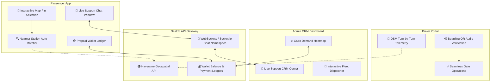

# 🗺️ D-Ride: Next-Stage Product & Engineering Roadmap

This document outlines the strategic engineering roadmap and feature release plan for the D-Ride autonomous mass-transit monorepo ecosystem. It spans the Passenger Client Portal, Driver Portal, Admin CRM Dashboard, and the NestJS Backend API services.

---

## 🚀 Roadmap Overview & Architecture

Below is the dependency layout for upcoming features across the platform, mapping frontend features to backend capabilities:

---

## 📅 Phased Release Plan

The roadmap is structured into three execution phases designed to minimize risk, maximize utility, and enable seamless integration.

### Phase 1: Cashless Infrastructure & Spatial Booking (High Priority)
*Focus: Upgrade the booking flow with user-friendly geospatial intelligence and cashless convenience.*

*   **Passenger Client App**:
    *   **Map-Based Location Picker**: Allow users to drop a pin on the homepage interactive map to automatically select the nearest pickup station.
    *   **Prepaid Account Wallet**: Enable passengers to load credit balance into their account via Paymob, reducing checkout transaction friction.
*   **NestJS API Backend**:
    *   **Geospatial Nearest-Station API**: A queryable endpoint `/routes/nearest?lat=X&lng=Y` that ranks active stations by physical proximity using a high-precision Haversine mathematical model.
    *   **Wallet Ledger Model**: Implement a schema and ledger table tracing transaction deposits and booking deductions.

### Phase 2: Live Support Operations & Real-Time Chat (Medium Priority)
*Focus: Transition static customer support tickets into real-time interactive resolution portals.*

*   **Admin CRM Dashboard**:
    *   **Real-time Support Center**: A WebSocket-driven instant chat feed page where operators can chat directly with active passengers.
*   **Passenger Client App**:
    *   **In-App Support Chat Widget**: A bottom-floating live-chat panel connected to the WebSockets gateway.
*   **NestJS API Backend**:
    *   **Socket.io Chat Namespace**: Create a dedicated chat gateway namespace with persistence for session history.

### Phase 3: Telemetry & Intelligent Dispatch (Future Expansion)
*Focus: Enhance on-the-road driver navigation and admin planning tools.*

*   **Driver Portal**:
    *   **OSM Turn-by-Turn Telemetry**: Switch static straight-line maps to actual Cairo street layout routing curves using OpenStreetMap routing APIs.
*   **Admin CRM Dashboard**:
    *   **Demand Heatmap**: A visual overlay on the Leaflet dashboard mapping historical high-demand booking hotspots.

---

## 🛠️ Technology Stack Alignment

| Module | Core Technologies | Focus Areas |
| :--- | :--- | :--- |
| **client-app** | React, Vite, React Leaflet, Paymob SDK | Geospatial UI, Wallet Checkout, Chat Component |
| **driver-portal** | React, Vite, Web Audio API, Leaflet | QR Scanning, Audio Chimes, Street Routing Telemetry |
| **admin-dashboard** | React, Ant Design v5, SVG, Leaflet | CRM Chat Feed, SVG Donut Metrics, Heatmaps |
| **api (NestJS)** | NestJS, Mongoose, Socket.io, Redis | Geospatial Calculations, WebSocket Gateways, Ledgers |

---

> [!NOTE]
> All architectural enhancements will maintain design consistency with the Egypt-inspired **Golden Amber (`#f5b731`) & Deep Onyx** design system.
